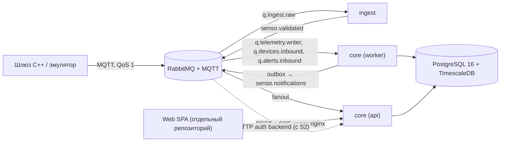

# senso-backend

Серверная платформа **SensoBazaar**: приём телеметрии и событий безопасности от IoT-шлюзов по MQTT, реестр шлюзов и устройств, история измерений, алерты и realtime-поток для веб-клиента.

> Статус: MVP в разработке (спринты по 2 недели, сентябрь 2026 – январь 2027).
> Архитектурное решение: [`docs/adr/ADR-0001-v2-backend-architecture.md`](docs/adr/ADR-0001-v2-backend-architecture.md).

---

## Содержание

- [Что делает сервис](#что-делает-сервис)
- [Архитектура за 2 минуты](#архитектура-за-2-минуты)
- [Стек](#стек)
- [Быстрый старт](#быстрый-старт)
- [Структура репозитория](#структура-репозитория)
- [Модули `core`](#модули-core)
- [Потоки данных](#потоки-данных)
- [Контракты](#контракты)
- [Конфигурация](#конфигурация)
- [Тесты](#тесты)
- [Правила разработки](#правила-разработки)
- [Частые проблемы](#частые-проблемы)
- [Связанные репозитории](#связанные-репозитории)

---

## Что делает сервис

| Возможность (MVP) | Где живёт |
| --- | --- |
| Регистрация, вход, ротация сессии (JWT + refresh-cookie) | `core` → модуль `identity` |
| Создание шлюза, выдача MQTT-учётных данных, подтверждение найденных датчиков | `core` → модуль `devices` |
| Приём и проверка сообщений шлюза (JSON Schema, лимиты, DLQ) | сервис `ingest` |
| Хранение измерений, графики (сырые данные и агрегаты 1m/1h) | `core` → модуль `telemetry` |
| Приём `SECURITY_EVENT` от IDS шлюза, дедупликация, жизненный цикл алерта | `core` → модуль `alerts` |
| Realtime для браузера (SSE): новые алерты, статусы устройств, живые значения | `core` → модуль `realtime` |

Вне MVP: блокчейн, оплата, маркетплейс, команды устройствам, проверка подписи сообщений (контракт её уже содержит, проверка выключена флагом).

## Архитектура за 2 минуты

**Модульный монолит `core` + отдельный сервис `ingest`.** Один jar `core` запускается в двух ролях: `api` (REST, SSE, миграции) и `worker` (консьюмеры очередей, запись телеметрии, планировщики). Границы модулей внутри `core` проверяются автоматически (Spring Modulith + ArchUnit), поэтому любой модуль можно позже вынести в отдельный сервис без смены модели данных.



Главные принципы:

- **Контракты первичны.** OpenAPI и JSON Schema лежат в репозитории [`senso-contracts`](#связанные-репозитории), подключены сюда сабмодулем `contracts/`. Код генерируется или проверяется по ним.
- **At-least-once + идемпотентность.** Сообщение может прийти дважды, приёмники это переживают (`messageId`, `ON CONFLICT DO NOTHING`, upsert).
- **Схема БД на модуль**, без внешних ключей и join между схемами.
- **Доступ по владельцу.** Пользователь видит только свои шлюзы, устройства, измерения и алерты. Чужое → `404`.

## Стек

| Область | Технологии |
| --- | --- |
| Язык, фреймворк | Java 21, Spring Boot 4.1.x, Spring Modulith 2.1.x |
| Web | Spring MVC, виртуальные потоки, SSE (`SseEmitter`) |
| Безопасность | Spring Security Resource Server, JWT RS256 + JWKS, BCrypt |
| Данные | PostgreSQL 16, TimescaleDB 2.x, Flyway, Spring Data JPA, JdbcTemplate (горячий путь телеметрии) |
| Сообщения | RabbitMQ 4.x (плагины MQTT, management), Spring AMQP |
| Контракты | OpenAPI 3.1 (openapi-generator, интерфейсы контроллеров), JSON Schema 2020-12 (валидация в `ingest`) |
| Маппинг | MapStruct, Java records для DTO |
| Фоновые задачи | Spring Scheduling + ShedLock |
| Наблюдаемость | Actuator, Micrometer, Prometheus; с S5 Grafana, Loki, OpenTelemetry |
| Тесты | JUnit 5, Testcontainers, ArchUnit, Spring Modulith Test, Awaitility |
| Сборка, поставка | Maven (wrapper), Docker, Docker Compose, GitHub Actions |
| Эмулятор шлюза | Python 3.12, paho-mqtt |

Точные версии зафиксированы в `pom.xml` (раздел `<properties>`).

## Быстрый старт

### Требования

- JDK 21 (Temurin)
- Docker Desktop / Docker Engine с Compose v2
- Git
- Python 3.12 (только для эмулятора)
- 8 ГБ RAM свободно для полного стека

### 1. Клонировать вместе с контрактами

```bash
git clone --recurse-submodules git@github.com:<org>/senso-backend.git
cd senso-backend
# если уже склонировали без сабмодуля:
git submodule update --init --recursive
```

### 2. Поднять инфраструктуру

```bash
cp deploy/.env.example deploy/.env
docker compose -f deploy/docker-compose.yml up -d          # PostgreSQL + TimescaleDB, RabbitMQ
```

| Сервис | Адрес | Логин |
| --- | --- | --- |
| PostgreSQL | `localhost:5432`, БД `senso` | из `deploy/.env` |
| RabbitMQ management | http://localhost:15672 | из `deploy/.env` |
| MQTT (без TLS, только локально) | `localhost:1883` | `gw-emulator-01` / из `deploy/.env` |

### 3. Запустить приложения из IDE или консоли

Локально удобнее запускать `core` сразу в обеих ролях (профиль `local` включает `api` и `worker`):

```bash
./mvnw -pl core-app -am spring-boot:run -Dspring-boot.run.profiles=local
./mvnw -pl ingest-app -am spring-boot:run -Dspring-boot.run.profiles=local
```

На Windows используйте `mvnw.cmd`.

API: http://localhost:8080/api/v1, health: http://localhost:8080/actuator/health.

### 4. Или всё в контейнерах

```bash
docker compose -f deploy/docker-compose.yml --profile app up -d --build
```

Профили compose:

| Профиль | Что добавляет |
| --- | --- |
| (без профиля) | `postgres`, `rabbitmq` |
| `app` | `core-api`, `core-worker`, `ingest` |
| `emulator` | эмулятор шлюза |
| `obs` | Prometheus, Grafana (с S5) |

### 5. Отправить данные эмулятором

```bash
cd tools/emulator
python -m venv .venv && source .venv/bin/activate    # Windows: .venv\Scripts\activate
pip install -r requirements.txt
python -m emulator --scenario normal --gateways 1 --devices 3
python -m emulator --scenario anomaly               # SECURITY_EVENT
```

Сценарии: `normal`, `anomaly`, `discover`, `malformed`, `duplicate`, `out-of-order`, `offline`, `flood`.

### 6. Сборка и проверки

```bash
./mvnw verify                 # компиляция, unit, интеграционные тесты (нужен Docker), ArchUnit, Modulith verify
./mvnw spotless:apply         # форматирование
./mvnw -pl core-app -am package -DskipTests
```

## Структура репозитория

```
senso-backend/
├─ contracts/                    # git submodule → senso-contracts (OpenAPI, JSON Schema, примеры)
├─ platform-kernel/              # общая библиотека: Id, Clock, Problem Details, базовые исключения
├─ messaging-contracts/          # Java records для MQTT-сообщений и внутренних событий, константы топиков и очередей
├─ core-app/                     # модульный монолит (роли api | worker)
│  └─ src/main/java/dev/senso/core/
│     ├─ identity/  devices/  telemetry/  alerts/  realtime/
│     └─ shared/                 # инфраструктура приложения: security, web, messaging, конфиг ролей
├─ ingest-app/                   # сервис приёма: валидация, нормализация, DLQ
├─ tools/emulator/               # эмулятор шлюза (Python)
├─ deploy/                       # docker-compose, конфиги RabbitMQ, nginx, Prometheus
├─ docs/
│  ├─ adr/                       # архитектурные решения
│  └─ modules/                   # документация модулей (генерируется Modulith + ручные заметки)
├─ .github/workflows/            # CI
└─ pom.xml                       # parent POM
```

## Модули `core`

Каждый модуль это пакет `dev.senso.core.<module>`. Публичное API модуля лежит в подпакете `api` (помечен `@NamedInterface`), всё остальное в `internal` и недоступно другим модулям.

| Модуль | Отвечает за | Схема БД | Зависит от | Владелец |
| --- | --- | --- | --- | --- |
| `identity` | Пользователи, роли, вход, JWT, refresh-ротация | `identity` | – | Java Developer A (ревью TL) |
| `devices` | Шлюзы, устройства, статусы, online/offline, MQTT-авторизация | `devices` | `identity::api` | Java Developer A |
| `telemetry` | Запись и чтение измерений, агрегаты, живые значения | `telemetry` | `devices::api` | Java Tech Lead |
| `alerts` | Приём `SECURITY_EVENT`, дедупликация, жизненный цикл, счётчики | `alerts` | `devices::api` | Java Developer B |
| `realtime` | SSE-потоки, реестр подписчиков, фильтрация по владельцу | – | `devices::api`, `alerts::api` | Java Developer B |

Внутри модуля:

```
<module>/
├─ package-info.java             # @ApplicationModule(allowedDependencies = …)
├─ api/                          # фасады, DTO, доменные события (…V1) — то, что видят другие модули
└─ internal/
   ├─ domain/                    # сущности, правила, состояния
   ├─ persistence/               # репозитории (JPA / JdbcTemplate)
   ├─ web/                       # контроллеры (реализуют сгенерированные OpenAPI-интерфейсы), роль api
   ├─ messaging/                 # AMQP-листенеры, роль worker
   └─ config/
```

## Потоки данных

**Телеметрия:** шлюз публикует в `senso/v1/gw/{gatewayId}/telemetry` → RabbitMQ кладёт в `amq.topic` с ключом `senso.v1.gw.{id}.telemetry` → очередь `q.ingest.raw` → `ingest` проверяет схему и лимиты → публикует в обменник `senso.validated` с ключом `telemetry.v1` → `q.telemetry.writer` → `core-worker` пакетно пишет в `telemetry.measurements`.

**Событие безопасности:** `.../events` (`SECURITY_EVENT`) → `ingest` → `security.event.v1` → `q.alerts.inbound` → `alerts` создаёт или обновляет алерт → событие `AlertRaised` через outbox → `senso.notifications` → каждый инстанс `core-api` → SSE `alert.created` в браузер владельца.

**Невалидное сообщение:** `ingest` отправляет его в `senso.dlq` с заголовком `x-reject-reason`. Смотреть в RabbitMQ management → очередь `q.dlq.invalid`.

## Контракты

- REST: `contracts/openapi/senso-api.v1.yaml`. Maven генерирует из него интерфейсы контроллеров и модели (`core-app/target/generated-sources/openapi`). Контроллеры их реализуют. Генерированный код не редактируется.
- MQTT: `contracts/mqtt/*.schema.json` и примеры `contracts/mqtt/examples/*.json`. `ingest` валидирует входящие сообщения по этим схемам. Тест `ContractExamplesTest` проверяет, что все примеры проходят валидацию и десериализуются в records из `messaging-contracts`.
- Изменение контракта: сначала PR в `senso-contracts` с апрувом затронутой команды (фронт или C++), затем обновление сабмодуля здесь:

```bash
cd contracts && git fetch && git checkout <tag-or-commit> && cd ..
git add contracts && git commit -m "chore(contracts): bump to <tag>"
```

## Конфигурация

Все параметры задаются переменными окружения (см. `deploy/.env.example`). Основные:

| Переменная | Назначение | Пример (local) |
| --- | --- | --- |
| `SPRING_PROFILES_ACTIVE` | `api`, `worker`, `local` (= api + worker + dev-удобства) | `local` |
| `SENSO_DB_URL`, `SENSO_DB_USER`, `SENSO_DB_PASSWORD` | PostgreSQL | `jdbc:postgresql://localhost:5432/senso` |
| `SENSO_RABBIT_HOST`, `SENSO_RABBIT_USER`, `SENSO_RABBIT_PASSWORD` | RabbitMQ (AMQP) | `localhost` |
| `SENSO_JWT_PRIVATE_KEY`, `SENSO_JWT_PUBLIC_KEY` | Ключи подписи JWT (PEM) | в `local` генерируются при старте |
| `SENSO_CORS_ALLOWED_ORIGINS` | Разрешённые origin (обычно пусто: SPA на том же origin) | `http://localhost:5173` |
| `SENSO_INGEST_SIGNATURE_REQUIRED` | Проверка подписи сообщений шлюза | `false` |

Секреты не коммитятся. `deploy/.env` в `.gitignore`.

## Тесты

| Уровень | Где | Команда |
| --- | --- | --- |
| Unit | `src/test/java/**/*Test.java` | `./mvnw test` |
| Интеграционные (Testcontainers) | `src/test/java/**/*IT.java` | `./mvnw verify` |
| Архитектура | `core-app/src/test/java/dev/senso/core/ArchitectureTest.java` | входит в `verify` |
| Контракты | `ContractExamplesTest`, проверка OpenAPI | входит в `verify` |
| Сквозной скелет | `WalkingSkeletonIT` (брокер → ingest → worker → БД) | входит в `verify` |

Интеграционные тесты поднимают `timescale/timescaledb` и `rabbitmq` в контейнерах. Нужен запущенный Docker.

## Правила разработки

- Ветки: `feature/SCRUM-<n>-<кратко>`, `fix/…`. PR небольшие, в `main` только через PR с зелёным CI.
- Коммиты: [Conventional Commits](https://www.conventionalcommits.org/) (`feat(devices): …`, `fix(alerts): …`).
- Ревью: минимум один участник. Для `identity`, `ingest`, безопасности и миграций обязательно ревью TL (`CODEOWNERS`).
- Миграции Flyway: `core-app/src/main/resources/db/migration/<module>/V<yyyyMMddHHmm>__<module>_<описание>.sql`. Изменять уже слитые миграции нельзя.
- Не нарушать границы модулей: другой модуль доступен только через его `api`. CI это проверит.

**Definition of Done:** код и тесты; контракт обновлён (если менялся); миграция; негативный тест на доступ к чужим данным для каждого нового endpoint; метрики и логи для нового сценария; зелёный CI; ревью.

Полные правила для людей и AI-агентов: [`AGENTS.md`](AGENTS.md).

## Частые проблемы

| Симптом | Причина и решение |
| --- | --- |
| Тесты падают с `Could not find a valid Docker environment` | Docker не запущен или нет доступа к сокету |
| `contracts/` пустая папка | Не подтянут сабмодуль: `git submodule update --init --recursive` |
| Flyway: `cannot create continuous aggregate … inside a transaction block` | В заголовке миграции нужен `-- flyway:executeInTransaction=false`, либо вынести агрегат в `R__`/отдельный файл без транзакции |
| Эмулятор подключился, но в БД пусто | Устройство в статусе `PENDING` (телеметрия не сохраняется до подтверждения) или сообщение ушло в DLQ, смотрите `q.dlq.invalid` |
| SSE обрывается через ~60 секунд | Прокси буферизует или режет соединение: в nginx `proxy_buffering off; proxy_read_timeout 1h;` |
| Скрипты `*.sh` в контейнере падают с `\r: command not found` | Windows-переводы строк. В репозитории `.gitattributes` фиксирует LF, пересклонируйте или `git add --renormalize .` |

## Связанные репозитории

| Репозиторий | Что там |
| --- | --- |
| `senso-contracts` | OpenAPI для фронта, JSON Schema и примеры MQTT для C++ команды. Источник истины |
| `senso-frontend` | React SPA |
| `senso-gateway` (C++ команда) | Прошивка/ПО шлюза, IDS, криптомодуль |
