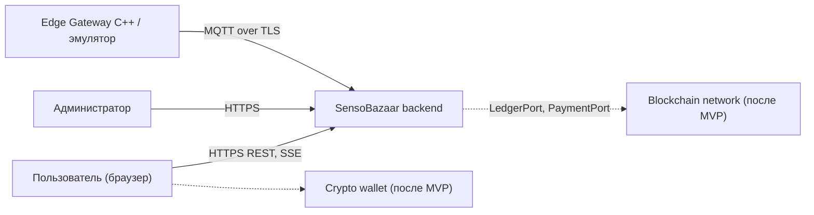
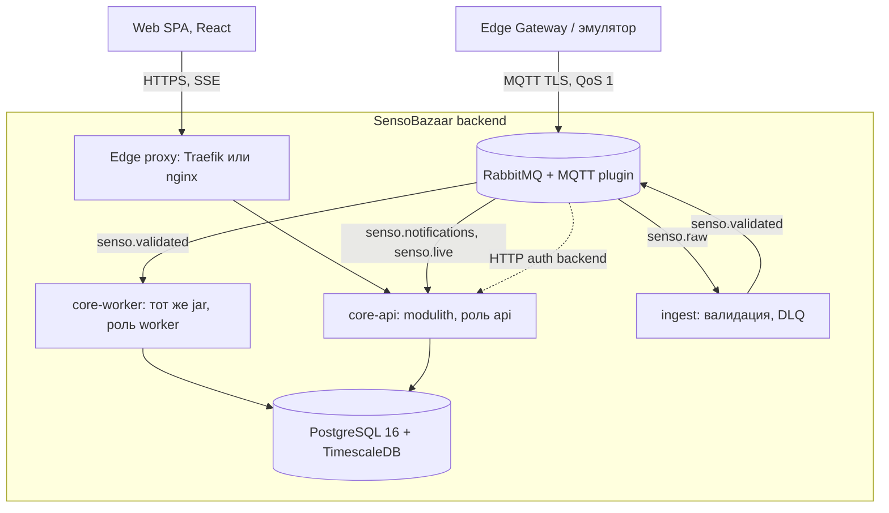
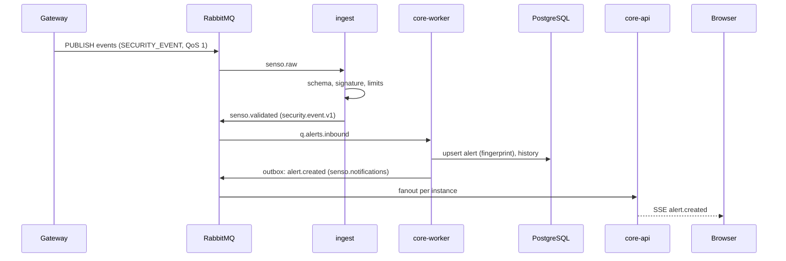
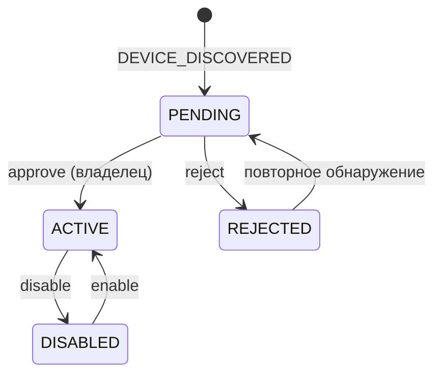

# ADR-0001. Архитектура серверной платформы SensoBazaar

## 0. Кратко

- Backend строится как **модульный монолит** (`core`) плюс один отдельный сервис **`ingest`** на входе телеметрии. Все границы будущих сервисов проводятся сейчас, физически разделяем только когда появится причина.
- Транспорт шлюз → платформа: **MQTT** (TLS, QoS 1). Брокер на MVP: **RabbitMQ с MQTT-плагином** (один брокер для устройств и для внутренних событий).
- Аномалии детектирует **шлюз (IDS)** и присылает `SECURITY_EVENT`. Платформа их принимает, дедуплицирует, хранит, показывает. Свои серверные правила откладываем.
- Хранилище: **PostgreSQL 16 + TimescaleDB**, отдельная схема на модуль, без FK и join между схемами.
- Realtime до браузера: **SSE** (не WebSocket/STOMP).
- Вход для людей: **Traefik/nginx + Spring Security Resource Server** вместо Spring Cloud Gateway. JWT подписывается асимметрично (JWKS).
- Сага заменена **моделью статусов устройства** (`PENDING → ACTIVE`) и асинхронной аттестацией после MVP.
- Контракты первичны: `contracts/` (JSON Schema для MQTT, OpenAPI для REST) лежит в репозитории и проверяется в CI обеими командами.
- Блокчейн и оплата закрыты **портами** (`LedgerPort`, `PaymentPort`) с заглушками. Когда дойдём до крипты, `payments`/`ledger` выделяются отдельным сервисом.

## 1. Контекст и постановка проблемы

SensoBazaar задуман как маркетплейс IoT-данных: провайдеры подключают устройства и продают данные, потребители покупают доступ, расчёты идут через кошелёк и смарт-контракты. Edge-часть (Raspberry Pi, C++17: MQTT-брокер и мост, IDS-модуль, криптомодуль) и блокчейн-сеть делает C++-команда.

**Объём MVP (по ТЗ и договорённостям)**

- Блокчейн, кошельки и оплата исключены. Нужны «просто база и общение между всеми участниками системы».
- Регистрация и вход.
- Список устройств (карточки со статусами), страница устройства, добавление и подключение устройства.
- Данные и статистика по устройствам.
- Алерты безопасности: приходят от шлюза, показываются на любой странице, у алерта есть страница с подробностями (время, id устройства, что не так).
- Фильтрация, сортировка, пагинация для большой базы событий. SQL с клиента запрещён.

**Ограничения**

- Веб-команда 4 человека: Java Tech Lead , 2  Java, 1 Frontend (React). Параллельно 3–4 человека делают C++/IoT.
- Agile, спринты по 2 недели, развитие каждый спринт до января 2027.
- Формальных требований к числу сервисов или паттернам нет.
- Реального шлюза на первых спринтах не будет, разработка идёт против эмулятора и контракта.

### 1.1. Что изменилось относительно v1

| Тема | v1 | v2 | Причина |
| --- | --- | --- | --- |
| Топология | 6 микросервисов + общая `common-contracts` | Модульный монолит + `ingest` | Домен маркетплейса ещё не оформлен, команда мала, дешевле менять границы модулей, чем сервисов |
| Оркестрация | `orchestration-service`, Saga, Spring StateMachine | Статусная модель + локальные транзакции + outbox | Онбординг умещается в один bounded context, а блокчейн-шаг асинхронен и не должен блокировать активацию |
| Вход | Spring Cloud Gateway (WebFlux) | Traefik/nginx + Resource Server в `core` | Реактивный стек без выгоды для команды с джунами |
| Транспорт от шлюза | HTTPS POST | MQTT (HTTP только для одноразового enrollment) | Архитектура edge уже строится вокруг MQTT |
| Детекция аномалий | На backend (`AnomalyDetectionEngine`) | На шлюзе, backend принимает `SECURITY_EVENT` | Так решено в ТЗ. Серверные правила позже как вторая линия |
| JWT | HS256, общий секрет | EdDSA/RS256 + JWKS | Только identity держит приватный ключ, выделение сервисов не потребует смены схемы |
| Realtime | WebSocket/STOMP через gateway | SSE | Нужен только поток сервер → браузер |
| Владение | Нет `owner_id` | Владелец у шлюза, доступ по владельцу | Защита от IDOR и база для маркетплейса |
| Хранение телеметрии | Таблица с JSONB | Hypertable TimescaleDB, узкая модель метрик | Сжатие, retention, агрегаты для графиков |
| Надёжность | Запись в БД и публикация в брокер раздельно | Идемпотентные приёмники, DLQ, outbox | Иначе потеря событий при сбое между шагами |
| Redis | Обязателен | Не входит в MVP | Сессии, blacklist и rate limit решаются без него |
| Наблюдаемость | Нет | Метрики, логи, трейсы с первого спринта | Иначе отладка асинхронного потока невозможна |

## 2. Факторы решения

1. **Скорость доставки ценности** на горизонте 3,5 месяцев и 4 человек.
2. **Неопределённость домена** (роли, доступ к данным, оплата): границы должны быть дешёвыми в изменении.
3. **Готовность к росту**: платежи, смарт-контракты, индексатор блокчейна, команды устройств.
4. **Независимость от C++-команды**: эмулятор и контракты вместо ожидания шлюза.
5. **Надёжность данных**: потеря телеметрии и алертов недопустима, дубли безопасны.
6. **Безопасность по умолчанию**: доверять шлюзу можно только подписанным сообщениям, пользователь видит только своё.
7. **Безопасная среда для джунов**: чёткие зоны владения, автоматическая защита границ.
8. **Операционная простота**: всё поднимается одной командой на ноутбуке разработчика.

## 3. Рассмотренные варианты

| Критерий | A. Модульный монолит + ingest (выбран) | B. 6 микросервисов (v1) | C. Классический монолит |
| --- | --- | --- | --- |
| Скорость первых спринтов | Высокая | Низкая (инфраструктура, контракты, отладка) | Высокая |
| Стоимость смены границ | Низкая (рефакторинг в одном репозитории) | Высокая (контракты, миграции данных, деплой) | Низкая, но границ нет |
| Готовность к выделению сервисов | Высокая при соблюдении правил модулей | Уже разделено | Низкая, «спагетти» |
| Изоляция работы джунов | Средняя–высокая (модули, CODEOWNERS, ArchUnit) | Высокая | Низкая |
| Операционная сложность | Низкая (3 контейнера приложений) | Высокая | Минимальная |
| Отладка сквозных сценариев | Простая | Сложная (трассировка, ретраи, рассинхрон) | Простая |
| Риск «распределённого монолита» | Нет | Высокий на неизвестном домене | Нет |

Вариант B оправдан, когда есть независимые команды, разные требования к масштабированию и известные границы. Сегодня ничего из этого нет. Вариант C отвергнут из-за отсутствия внутренних границ: он сделает рост в маркетплейс дорогим.

## 4. Решение

**Выбран вариант A.** Приложение `core` собрано из Maven-модулей по bounded context (`identity`, `devices`, `telemetry`, `alerts`, `realtime`). Границы контролирует Spring Modulith (`verify()`) и ArchUnit в CI. Сервис `ingest` физически отделён, потому что он общается с недоверенным внешним миром, имеет другой профиль нагрузки и не должен падать вместе с UI.

Один и тот же артефакт `core` запускается в двух ролях (Spring-профили):

- `api`: REST, SSE, внутренний endpoint авторизации MQTT, миграции;
- `worker`: AMQP-консьюмеры, outbox-релей, планировщики.

### 4.1. Последствия

Положительные

- Единый репозиторий, единый деплой, локальные транзакции и простая отладка.
- Сетевые границы появятся только там, где они дают выгоду (`ingest`, позже `payments`).
- Порты `LedgerPort`, `PaymentPort`, `GatewayCommandPort` позволяют подключить крипту и команды устройствам без переписывания бизнес-логики.

Отрицательные и компромиссы

- Дисциплина границ держится на автоматических проверках, а не на сети: без `verify()` в CI монолит деградирует.
- Один релизный цикл `core`: падение в модуле alerts может задержать релиз devices.
- Общая БД-инстанция: тяжёлые запросы модуля telemetry влияют на остальные (смягчаем пулами, таймаутами, репликой для чтения позже).

### 4.2. Проверка решения (Confirmation)

- `ModularityTests.verify()` и ArchUnit-правила зелёные в CI, циклов между модулями нет.
- Сквозной тест: эмулятор публикует `SECURITY_EVENT`, алерт появляется в SSE не позже 2 секунд (p95).
- Остановка `core-worker` посреди пакета не приводит к потере данных: после перезапуска все сообщения обработаны, дублей нет.
- JSON Schema валидирует примеры эмулятора и C++-шлюза в CI обоих репозиториев.
- Пользователь A не получает данные пользователя B ни через один endpoint (набор негативных тестов на владение).

## 5. Архитектура

### 5.1. Системный контекст



### 5.2. Контейнеры



| Контейнер | Технологии | Порты | Назначение |
| --- | --- | --- | --- |
| Edge proxy | Traefik (или nginx) | 80/443 наружу | TLS, CORS, rate limit, маршрутизация `/api`, `/` (SPA), отключённая буферизация для SSE |
| `core-api` | Java 21, Spring Boot 3.x, Spring Modulith | 8080 внутри | REST, SSE, Resource Server, внутренний auth backend для брокера, Flyway |
| `core-worker` | тот же образ, профиль `worker` | нет входящих | Потребление событий, запись телеметрии, алерты, outbox, планировщики (ShedLock) |
| `ingest` | Java 21, Spring Boot 3.x, Spring AMQP | нет входящих | Валидация схем, проверка подписи, нормализация, DLQ |
| RabbitMQ | RabbitMQ + плагины MQTT и management | 8883 (MQTT TLS) наружу, 5672 и 15672 внутри | Точка входа устройств и внутренняя шина |
| PostgreSQL | PostgreSQL 16 + TimescaleDB | 5432 внутри | Схемы `identity`, `devices`, `telemetry`, `alerts`, `platform` |
| Наблюдаемость | Prometheus, Grafana, Loki, OpenTelemetry Collector | профиль compose `obs` | Метрики, логи, трейсы |

### 5.3. Модули `core`

| Модуль | Ответственность | Владеет схемой | Публичное API (`..api`) | Публикует события | Потребляет | Владелец         |
| --- | --- | --- | --- | --- | --- |------------------|
| `identity` | Регистрация, вход, JWT, refresh-ротация, роли, пользователи | `identity` | `CurrentUser`, `UserLookup` | `UserRegistered` | нет | Java Developer A |
| `devices` | Шлюзы, устройства, enrollment, жизненный цикл, связность (online/offline), авторизация MQTT | `devices` | `DeviceQueries` (`resolve`, `accessibleDeviceIds`, `find`), `GatewayAuthApi` | `DeviceApproved`, `DeviceChanged`, `GatewayStatusChanged` | `device.discovered.v1`, `gateway.status.v1` | Junior A         |
| `telemetry` | Запись и чтение измерений, агрегаты, экспорт живых значений | `telemetry` | `MeasurementQueries` | `senso.live` (в брокер) | `telemetry.v1` | Java Tech Lead   |
| `alerts` | Приём `SECURITY_EVENT`, дедупликация, жизненный цикл алерта, история, счётчики | `alerts` | `AlertQueries`, `AlertCommands` | `AlertRaised`, `AlertStateChanged` | `security.event.v1`, `GatewayStatusChanged` | Junior B         |
| `realtime` | SSE-эндпоинт, реестр подписок, фильтрация по владельцу | нет (без БД) | нет | нет | `senso.notifications`, `senso.live` | Java Developer B |
| `platform-kernel` | Минимум общего: идентификаторы, Problem Details, время, интерфейс контекста безопасности | нет | да | нет | нет | Java Tech Lead   |

Резервируемые (пока не создаются) модули: `marketplace` (предложения данных, гранты доступа, заказы), `payments` (`PaymentPort`), `ledger` (`LedgerPort`, аттестация батчей).

### 5.4. Правила модулей (проверяются в CI)

1. Модуль открывает только пакет `..api`. Всё остальное в `..internal`.
2. Зависимости направлены вниз: `devices → identity-api`, `telemetry → devices-api`, `alerts → devices-api`, `realtime → devices-api, alerts-api`. `identity` не зависит ни от кого. Циклов нет.
3. Общих entity нет. Данные другого модуля берутся через его `api`, результат не кэшируется дольше, чем нужно, и не хранится как «истина».
4. У каждого модуля своя схема БД. Внешних ключей и join между схемами нет. Связь через `uuid` (логическая ссылка).
5. Межмодульные события версионируются (`...V1`), в payload только примитивы и id.
6. Асинхронные события во внешний мир (в брокер) идут через outbox (Spring Modulith event publication registry + externalization в AMQP).
7. Ни один модуль не обращается к брокеру устройств напрямую: только через свои inbound-адаптеры.
8. Проверка владельца выполняется в API-слое модуля, не на фронте.

### 5.5. Структура репозитория

```
senso-platform/
├─ contracts/                      # источник истины, общий с C++ командой
│  ├─ mqtt/
│  │  ├─ TOPICS.md
│  │  ├─ envelope.schema.json
│  │  ├─ payloads/*.schema.json
│  │  └─ examples/*.json           # валидируются в CI
│  └─ openapi/senso-api.v1.yaml
├─ backend/
│  ├─ pom.xml                      # parent
│  ├─ platform-kernel/
│  ├─ messaging-contracts/         # DTO, сгенерированные из contracts/mqtt
│  ├─ identity/  devices/  telemetry/  alerts/  realtime/
│  ├─ core-app/                    # Spring Boot main, профили api | worker
│  └─ ingest-app/
├─ frontend/                       # React, клиент генерируется из OpenAPI
├─ tools/emulator/                 # Python, paho-mqtt: сценарии и нагрузка
├─ deploy/                         # docker-compose (profiles), rabbitmq, prometheus, grafana
└─ docs/adr/                       # этот файл и следующие ADR
```

### 5.6. Технологический стек

| Область | Решение |
| --- | --- |
| Язык и фреймворк | Java 21, Spring Boot 3.x, Spring Modulith, Spring Security (Resource Server), Spring AMQP, Spring Data JPA (+ JdbcTemplate на горячем пути) |
| Данные | PostgreSQL 16, TimescaleDB, Flyway (миграции по схемам), MapStruct |
| Контракты | OpenAPI 3 (contract-first, генерация серверных интерфейсов и TS-клиента), JSON Schema 2020-12 для MQTT |
| Брокер | RabbitMQ с MQTT-плагином (замена на EMQX по триггерам из раздела 15) |
| Тесты | JUnit 5, Testcontainers, ArchUnit, Spring Modulith tests, k6 или эмулятор для нагрузки |
| Наблюдаемость | Micrometer, Prometheus, Grafana, Loki, OpenTelemetry |
| Поставка | Docker, docker-compose profiles, GitHub Actions |

## 6. Контракт «шлюз → платформа» (MQTT)

### 6.1. Топики

Префикс `senso/v1/gw/{gatewayId}/`, где `gatewayId` это `external_id` шлюза (`^[a-z0-9-]{3,64}$`).

| Канал | Направление | Типы сообщений | QoS | Retained |
| --- | --- | --- | --- | --- |
| `telemetry` | шлюз → платформа | `TELEMETRY` | 1 | нет |
| `events` | шлюз → платформа | `DEVICE_DISCOVERED`, `SECURITY_EVENT` | 1 | нет |
| `status` | шлюз → платформа | `GATEWAY_STATUS` (включая Last Will) | 1 | да |
| `cmd` | платформа → шлюз | зарезервировано (команды устройствам, не в MVP) | 1 | нет |
| `ack` | шлюз → платформа | зарезервировано (подтверждения команд) | 1 | нет |

В RabbitMQ разделитель `/` превращается в `.`, поэтому маршрутные ключи выглядят как `senso.v1.gw.<id>.telemetry`, а привязка идёт к `amq.topic`.

### 6.2. Envelope (общий для всех типов)

```json
{
  "schemaVersion": 1,
  "messageId": "0195f3c2-7d1e-7a4b-9c11-2b6f0e5a8d34",
  "gatewayId": "gw-lab-main",
  "type": "TELEMETRY",
  "sentAt": "2026-09-25T10:15:30.120Z",
  "seq": 10423,
  "payload": {},
  "signature": null
}
```

| Поле | Правило |
| --- | --- |
| `schemaVersion` | Целое. Несовместимые изменения повышают версию, старые версии поддерживаются не менее одного спринта |
| `messageId` | UUID, уникален для сообщения и **сохраняется при повторной отправке** (основа идемпотентности) |
| `gatewayId` | Должен совпадать с сегментом топика и с MQTT-логином, иначе сообщение отклоняется |
| `type` | Один из перечисленных типов, должен соответствовать каналу |
| `sentAt` | ISO 8601, UTC, миллисекунды |
| `seq` | Монотонный счётчик шлюза, необязателен, нужен для диагностики потерь |
| `signature` | `null` в MVP. Далее `{ "alg": "ed25519", "kid": "...", "value": "base64" }` по каноническому JSON без поля `signature` |

Ограничения: размер сообщения до 256 КБ, до 500 сэмплов в одном `TELEMETRY`, время только в UTC.

### 6.3. Полезные нагрузки

`TELEMETRY`

```json
{
  "samples": [
    {
      "deviceId": "sensor-fridge-01",
      "ts": "2026-09-25T10:15:29.500Z",
      "metrics": { "temperature": 4.2, "humidity": 41.0 }
    }
  ]
}
```

`DEVICE_DISCOVERED`

```json
{
  "deviceId": "sensor-temp-hall-05",
  "deviceType": "TEMPERATURE",
  "capabilities": [ { "metric": "temperature", "unit": "CEL" } ],
  "metadata": { "firmware": "v1.2.0-rc", "busAddress": "0x48" }
}
```

`SECURITY_EVENT`

```json
{
  "deviceId": "sensor-fridge-01",
  "severity": "CRITICAL",
  "code": "PHYSICAL_ANOMALY",
  "message": "Температура -500.0 °C вне физически допустимого диапазона",
  "detectedAt": "2026-09-25T10:15:30.000Z",
  "detector": { "name": "ids", "version": "0.3.1" },
  "details": { "metric": "temperature", "value": -500.0 }
}
```

`severity`: `INFO | WARNING | CRITICAL`. `deviceId` может отсутствовать (событие уровня шлюза). Каталог `code` расширяемый (`PHYSICAL_ANOMALY`, `VALUE_OUT_OF_RANGE`, `SPIKE`, `SIGNATURE_INVALID`, `TAMPER_SUSPECTED`…). Неизвестные коды принимаются и показываются как есть.

`GATEWAY_STATUS`

```json
{ "state": "ONLINE", "firmware": "1.4.2", "uptimeSec": 86400, "deviceCount": 6, "queueDepth": 0 }
```

`state`: `ONLINE | DEGRADED | OFFLINE`. Last Will регистрируется при подключении с `state: OFFLINE`.

### 6.4. Правила приёма

1. **Аутентификация.** Логин MQTT равен `gatewayId`, пароль выдаётся при создании шлюза. Брокер обращается к `core-api` (HTTP auth backend): проверка пароля и ACL: шлюз публикует только в `senso/v1/gw/<свой id>/...` и читает только `.../cmd`.
2. **Валидация.** Схема envelope, схема payload по `type`, соответствие `gatewayId` топику. При ошибке сообщение уходит в `senso.dlq.invalid` с причиной, растёт метрика `ingest_messages_total{result="rejected"}`.
3. **Подпись.** При включённой проверке `ingest` сверяет подпись с публичным ключом шлюза (кэш). Неверная подпись отклоняется и порождает системный алерт `SIGNATURE_INVALID`.
4. **Время.** `sentAt` отличается от времени приёма больше чем на 5 минут: сообщение принимается, ставится флаг `clockSkew` в метрики. Сэмпл с `ts` дальше чем на 5 минут в будущее отбрасывается.
5. **Идемпотентность.** Дубли безопасны, сообщение может прийти повторно (QoS 1). Приёмники идемпотентны: телеметрия по ключу `(device_id, metric, ts)` через `ON CONFLICT DO NOTHING`, `SECURITY_EVENT` по `(gateway_id, message_id)`, `DEVICE_DISCOVERED` через upsert. `GATEWAY_STATUS` из дедупликации исключён: Last Will статичен и всегда с одним `messageId`.
6. **Неизвестное устройство.** `TELEMETRY` от неизвестного `deviceId` игнорируется (метрика), автоматическое создание происходит только по `DEVICE_DISCOVERED`. Лимит на число устройств в статусе `PENDING` на шлюз: 50.
7. **Устройства не в статусе `ACTIVE`.** Их телеметрия не сохраняется, счётчик растёт в метрике `telemetry_dropped_total{reason}`.

### 6.5. Поток обработки



Внутренние обменники и очереди

| Обменник | Тип | Назначение |
| --- | --- | --- |
| `amq.topic` | topic | Вход от устройств (через MQTT-плагин) |
| `senso.validated` | topic | Проверенные сообщения: `telemetry.v1`, `device.discovered.v1`, `security.event.v1`, `gateway.status.v1` |
| `senso.notifications` | fanout | Доменные уведомления для SSE (по анонимной очереди на каждый инстанс `core-api`) |
| `senso.live` | topic | Живые значения: ключ `device.<uuid>`, привязки создаются по подписке |
| `senso.dlq.*` | direct | Невалидные и «ядовитые» сообщения |

Очереди по модулям: `q.telemetry.writer`, `q.devices.inbound`, `q.alerts.inbound`. Все durable, с ограничением длины, `x-dead-letter-exchange`, повторами с экспоненциальной паузой (3 попытки), затем DLQ. Потребители используют ручное подтверждение после коммита в БД.

## 7. Жизненный цикл шлюза и устройства

### 7.1. Статусы устройства



`connectivity` (`UNKNOWN | ONLINE | OFFLINE`) хранится отдельно и вычисляется, а не задаётся вручную: для шлюза из `GATEWAY_STATUS` и Last Will, для устройства из `last_seen_at` и ожидаемого интервала (по умолчанию 3 × период публикации, минимум 60 секунд). Планировщик пересчёта на `worker` под ShedLock.

### 7.2. Подключение шлюза (pairing)

1. Владелец в UI создаёт шлюз (`POST /api/v1/gateways`) и один раз видит `gatewayId` и MQTT-пароль.
2. **MVP:** данные вручную вносятся в конфиг шлюза.
3. **Спринт 5:** enrollment. Шлюз вызывает `POST /api/v1/gateway-enrollment/claim` с одноразовым токеном (TTL 24 часа, хранится хэш), передаёт публичный ключ и версию прошивки, получает MQTT-параметры. Ключ пишется в `gateways.public_key`.
4. Шлюз подключается по MQTT и присылает `GATEWAY_STATUS: ONLINE`.
5. Подключённые к шлюзу датчики шлют `DEVICE_DISCOVERED`. Устройства появляются как `PENDING`, владелец подтверждает.

Ротация пароля: `POST /api/v1/gateways/{id}:rotate-credentials`, старый пароль отзывается немедленно (принудительный разрыв сессии брокера).

### 7.3. Асинхронная аттестация (после MVP)

Отдельный процесс, не связанный с активацией. `ledger` периодически собирает хэши сэмплов шлюза в дерево Меркла, вызывает `LedgerPort.attest(batch)` и сохраняет `merkle_root`, `tx_id`, `status` (`PENDING | CONFIRMED | FAILED`). В MVP порт реализует `MockLedgerAdapter`.

## 8. Модель данных

Идентификаторы `uuid` (UUIDv7, генерируются в приложении), время `timestamptz` в UTC. Внешних ключей между схемами нет, `owner_id` и подобные поля это логические ссылки.

### 8.1. `identity`

```sql
CREATE SCHEMA identity;
CREATE EXTENSION IF NOT EXISTS citext;

CREATE TABLE identity.users (
  id            uuid PRIMARY KEY,
  email         citext       NOT NULL UNIQUE,
  display_name  varchar(128) NOT NULL,
  password_hash varchar(255) NOT NULL,
  status        varchar(16)  NOT NULL DEFAULT 'ACTIVE',
  created_at    timestamptz  NOT NULL DEFAULT now(),
  updated_at    timestamptz  NOT NULL DEFAULT now()
);

CREATE TABLE identity.user_roles (
  user_id uuid        NOT NULL REFERENCES identity.users(id) ON DELETE CASCADE,
  role    varchar(32) NOT NULL,
  PRIMARY KEY (user_id, role)
);

CREATE TABLE identity.refresh_tokens (
  id          uuid PRIMARY KEY,
  user_id     uuid        NOT NULL REFERENCES identity.users(id) ON DELETE CASCADE,
  family_id   uuid        NOT NULL,
  token_hash  bytea       NOT NULL UNIQUE,
  expires_at  timestamptz NOT NULL,
  used_at     timestamptz,
  revoked_at  timestamptz,
  created_at  timestamptz NOT NULL DEFAULT now(),
  user_agent  varchar(256)
);
CREATE INDEX ix_refresh_family ON identity.refresh_tokens (family_id);
```

Повторное использование уже использованного refresh-токена отзывает всё семейство (`family_id`).

### 8.2. `devices`

```sql
CREATE SCHEMA devices;

CREATE TABLE devices.gateways (
  id                 uuid PRIMARY KEY,
  owner_id           uuid         NOT NULL,
  external_id        varchar(64)  NOT NULL UNIQUE,
  name               varchar(128) NOT NULL,
  mqtt_password_hash varchar(255),
  public_key         text,
  key_id             varchar(64),
  connectivity       varchar(16)  NOT NULL DEFAULT 'UNKNOWN',
  last_seen_at       timestamptz,
  firmware           varchar(64),
  enrolled_at        timestamptz,
  disabled_at        timestamptz,
  created_at         timestamptz  NOT NULL DEFAULT now(),
  updated_at         timestamptz  NOT NULL DEFAULT now()
);
CREATE INDEX ix_gateways_owner ON devices.gateways (owner_id);

CREATE TABLE devices.enrollment_tokens (
  id          uuid PRIMARY KEY,
  gateway_id  uuid        NOT NULL REFERENCES devices.gateways(id) ON DELETE CASCADE,
  token_hash  bytea       NOT NULL UNIQUE,
  expires_at  timestamptz NOT NULL,
  used_at     timestamptz
);

CREATE TABLE devices.devices (
  id            uuid PRIMARY KEY,
  gateway_id    uuid         NOT NULL REFERENCES devices.gateways(id) ON DELETE CASCADE,
  external_id   varchar(64)  NOT NULL,
  name          varchar(128),
  device_type   varchar(32)  NOT NULL,
  status        varchar(16)  NOT NULL DEFAULT 'PENDING',
  capabilities  jsonb        NOT NULL DEFAULT '[]',
  metadata      jsonb        NOT NULL DEFAULT '{}',
  connectivity  varchar(16)  NOT NULL DEFAULT 'UNKNOWN',
  last_seen_at  timestamptz,
  approved_by   uuid,
  approved_at   timestamptz,
  created_at    timestamptz  NOT NULL DEFAULT now(),
  updated_at    timestamptz  NOT NULL DEFAULT now(),
  UNIQUE (gateway_id, external_id)
);
CREATE INDEX ix_devices_gateway_status ON devices.devices (gateway_id, status);
```

### 8.3. `telemetry` (TimescaleDB)

```sql
CREATE SCHEMA telemetry;

CREATE TABLE telemetry.measurements (
  ts          timestamptz      NOT NULL,
  device_id   uuid             NOT NULL,
  metric      varchar(64)      NOT NULL,
  value       double precision NOT NULL,
  received_at timestamptz      NOT NULL DEFAULT now(),
  PRIMARY KEY (device_id, metric, ts)
);
SELECT create_hypertable('telemetry.measurements', 'ts', chunk_time_interval => interval '1 day');

CREATE MATERIALIZED VIEW telemetry.measurements_1m
WITH (timescaledb.continuous) AS
SELECT time_bucket('1 minute', ts) AS bucket, device_id, metric,
       avg(value) AS avg, min(value) AS min, max(value) AS max, count(*) AS n
FROM telemetry.measurements
GROUP BY 1, 2, 3
WITH NO DATA;
```

Политики (compression через 7 дней, retention сырых данных 90 дней, refresh continuous aggregate каждую минуту, агрегат `_1h` аналогично, retention 1m: 1 год, 1h: 5 лет) настраиваются миграцией. Синтаксис компрессии зависит от версии TimescaleDB, сверяем с документацией выбранной версии.

Запись: `JdbcTemplate.batchUpdate` или COPY с `ON CONFLICT DO NOTHING`. JPA с `BIGSERIAL/IDENTITY` на этом пути не используем, Hibernate не умеет батчить такие insert.

### 8.4. `alerts`

```sql
CREATE SCHEMA alerts;

CREATE TABLE alerts.alerts (
  id                 uuid PRIMARY KEY,
  owner_id           uuid         NOT NULL,
  gateway_id         uuid         NOT NULL,
  device_id          uuid,
  source             varchar(16)  NOT NULL,   -- GATEWAY_IDS | SYSTEM | SERVER_RULE
  severity           varchar(16)  NOT NULL,
  code               varchar(64)  NOT NULL,
  message            text         NOT NULL,
  details            jsonb        NOT NULL DEFAULT '{}',
  status             varchar(16)  NOT NULL DEFAULT 'OPEN',
  fingerprint        varchar(128) NOT NULL,
  occurrences        int          NOT NULL DEFAULT 1,
  first_occurred_at  timestamptz  NOT NULL,
  last_occurred_at   timestamptz  NOT NULL,
  acknowledged_by    uuid,
  acknowledged_at    timestamptz,
  resolved_by        uuid,
  resolved_at        timestamptz,
  created_at         timestamptz  NOT NULL DEFAULT now()
);
CREATE UNIQUE INDEX ux_alerts_open_fingerprint ON alerts.alerts (fingerprint)
  WHERE status IN ('OPEN', 'ACKNOWLEDGED');
CREATE INDEX ix_alerts_owner_time  ON alerts.alerts (owner_id, last_occurred_at DESC, id DESC);
CREATE INDEX ix_alerts_device_time ON alerts.alerts (device_id, last_occurred_at DESC);
CREATE INDEX ix_alerts_open        ON alerts.alerts (owner_id, severity, last_occurred_at DESC)
  WHERE status <> 'RESOLVED';

CREATE TABLE alerts.alert_history (
  id        bigserial PRIMARY KEY,
  alert_id  uuid        NOT NULL REFERENCES alerts.alerts(id) ON DELETE CASCADE,
  at        timestamptz NOT NULL DEFAULT now(),
  actor     uuid,
  action    varchar(32) NOT NULL,
  details   jsonb       NOT NULL DEFAULT '{}'
);

CREATE TABLE alerts.processed_messages (
  gateway_id   uuid        NOT NULL,
  message_id   uuid        NOT NULL,
  processed_at timestamptz NOT NULL DEFAULT now(),
  PRIMARY KEY (gateway_id, message_id)
);
```

`fingerprint = sha256(gateway_id | device_id | code)`. Пока алерт открыт, повторные события увеличивают `occurrences` и `last_occurred_at`, а не создают новую запись. `processed_messages` чистится по расписанию (хранение 7 дней). `owner_id` денормализуется в момент создания (через `devices-api`), чтобы фильтровать по владельцу без межмодульных join.

### 8.5. Служебное

Таблица публикации событий Spring Modulith (`event_publication`) живёт в схеме `platform`. Там же таблица блокировок ShedLock.

## 9. API

### 9.1. Соглашения

- Базовый путь `/api/v1`. Контракт первичен: `contracts/openapi/senso-api.v1.yaml`, серверные интерфейсы и TS-клиент генерируются.
- Ошибки в формате RFC 9457 (Problem Details): `type`, `title`, `status`, `detail`, `traceId`, при валидации список `errors`. Типы: `validation-failed`, `unauthorized`, `forbidden`, `not-found`, `conflict`, `rate-limited`.
- Списки: курсорная пагинация. Запрос `?limit=50&cursor=...` (limit до 100), ответ `{ "items": [], "nextCursor": "..." }`. Курсор это закодированный `(last_occurred_at, id)`.
- Создающие `POST` принимают `Idempotency-Key`.
- Чужие объекты отвечают `404`, а не `403`, чтобы не раскрывать существование.
- Время в ответах ISO 8601 UTC.

### 9.2. Ресурсы

| Область | Endpoint | Назначение |
| --- | --- | --- |
| Auth | `POST /auth/register`, `/auth/login`, `/auth/refresh`, `/auth/logout`; `GET /users/me` | Регистрация, вход, ротация сессии, профиль |
| Шлюзы | `GET, POST /gateways`; `GET, PATCH, DELETE /gateways/{id}`; `POST /gateways/{id}:rotate-credentials` | Каталог шлюзов владельца |
| Enrollment | `POST /gateway-enrollment/claim` | Публичный, авторизация одноразовым токеном (спринт 5) |
| Устройства | `GET /devices` (фильтры: `gatewayId`, `status`, `connectivity`, `type`, `q`); `GET, PATCH /devices/{id}`; `POST /devices/{id}:approve`, `:reject`, `:disable`, `:enable` | Карточки, подтверждение, управление |
| Телеметрия | `GET /devices/{id}/latest`; `GET /devices/{id}/measurements?metric&from&to&resolution=raw\|1m\|1h` | Последние значения и история для графиков |
| Алерты | `GET /alerts` (фильтры: `deviceId`, `gatewayId`, `severity`, `status`, `source`, `from`, `to`); `GET /alerts/{id}`; `POST /alerts/{id}:acknowledge`, `:resolve`; `GET /alerts/summary` | Журнал, детали, жизненный цикл, счётчик для бейджа |
| Поток | `GET /stream` (SSE) | Realtime |
| Админ | `GET /admin/users`; `PATCH /admin/users/{id}` | Только роль `ADMIN` |

Границы истории телеметрии: `resolution=raw` не более 6 часов и 10 000 точек за запрос, иначе сервер сам выбирает агрегат подходящей детализации.

### 9.3. SSE `/api/v1/stream`

- Клиент: `@microsoft/fetch-event-source` с заголовком `Authorization: Bearer`. Нативный `EventSource` не подходит, он не умеет заголовки.
- Всегда приходят события владельца: `alert.created`, `alert.updated`, `device.updated`, `gateway.status`.
- Живая телеметрия по подписке: `?deviceIds=id1,id2` (до 20). Частота на устройство не выше 1 события в секунду, остальное сжимается до последнего значения.
- Формат: `id` (монотонный), `event`, `data` (JSON). `Last-Event-ID` при переподключении не гарантирует доставку пропущенного, клиент после reconnect перезапрашивает `GET /alerts/summary` и текущие карточки.
- Heartbeat-комментарий каждые 15 секунд. Прокси не буферизует ответ и держит соединение не менее 1 часа.
- При истечении access-токена сервер закрывает поток, клиент делает refresh и подключается снова.

Внутри: каждый инстанс `core-api` держит свою анонимную очередь на `senso.notifications` и локальный реестр подписчиков. Для `senso.live` при первой подписке на устройство создаётся привязка `device.<uuid>`, при отсутствии подписчиков удаляется.

## 10. Безопасность

### 10.1. Аутентификация и сессии

- Access JWT: 15 минут, EdDSA (или RS256), `kid` в заголовке, публичные ключи в `/.well-known/jwks.json`. Клиент хранит токен **в памяти**, не в `localStorage`.
- Refresh: 7 дней, непрозрачная случайная строка, в БД только хэш, ротация при каждом использовании, обнаружение повторного использования, cookie `HttpOnly; Secure; SameSite=Strict`, путь `/api/v1/auth`.
- Пароли: Argon2id (или BCrypt cost ≥ 12). Троттлинг попыток входа на аккаунт и IP, без раскрытия «пользователь не найден».
- Роли на MVP: `ADMIN`, `USER`. Provider и Consumer позже станут **правами (grants)** одного аккаунта, а не жёсткими ролями.

### 10.2. Авторизация

- Владелец шлюза определяет доступ ко всему, что под ним: устройства, телеметрия, алерты.
- Единая точка проверки: `DeviceQueries.accessibleDeviceIds(userId)` и проверка владения в каждом сервисе модуля. Дублирование проверки в контроллерах не заменяет проверку в сервисе.
- Негативные тесты на владение обязательны для каждого нового endpoint (шаблон в общих тестовых утилитах).

### 10.3. Шлюз как недоверенный участник

| Угроза | Мера |
| --- | --- |
| Подмена шлюза | Пароль MQTT (позже клиентский сертификат), ACL по префиксу топика, подпись сообщений |
| Повтор старого сообщения (replay) | `messageId` + окно времени, идемпотентные приёмники, подпись покрывает `sentAt` |
| Флуд и большие сообщения | Лимит размера брокера, лимит сэмплов, лимит `PENDING`-устройств, rate limit на клиента в брокере |
| Отравление данных | Схемы, границы значений по типу датчика, DLQ, метрики отклонений |
| Кража ключа шлюза | Ротация кредов и ключа, отзыв немедленно, аудит |

### 10.4. Веб-уровень

- CORS только на разрешённый origin. CSRF закрыт `SameSite=Strict` и отсутствием cookie-авторизации для основных API (Bearer).
- Текст алертов и имена устройств приходят извне: на фронте выводятся только как текст, без `dangerouslySetInnerHTML`.
- Заголовки безопасности на прокси (HSTS, X-Content-Type-Options, CSP для SPA).
- Секреты только из окружения или Docker secrets, не из репозитория. Сканирование секретов и зависимостей в CI.
- Аудит-лог действий (вход, смена паролей, подтверждение устройств, закрытие алертов) с идентификатором актора.

## 11. Надёжность и потоки данных

| Аспект | Решение |
| --- | --- |
| Семантика доставки | At-least-once от шлюза до БД, идемпотентные приёмники дают эффективное «ровно один раз» |
| Порядок подтверждений | Консьюмер подтверждает сообщение только после коммита в БД |
| Ретраи | 3 попытки с экспоненциальной паузой, затем DLQ. Сообщения из DLQ можно переиграть вручную |
| Outbox | События `core → брокер` идут через реестр публикаций Spring Modulith. Запись в БД и запись события в одной транзакции, релей на `worker` |
| Обратное давление | Ограничение длины очередей, `prefetch` консьюмеров, пакетная запись (по 500 строк или 200 мс). Брокер держит пик, пока `worker` догоняет |
| Потеря связи шлюза | Шлюз буферизует локально (`MessageBuffer` в его архитектуре) и досылает с прежними `messageId` |
| Часы устройств | `ts` от шлюза сохраняется как факт измерения, `received_at` как факт получения. Графики строятся по `ts` |
| Упорядоченность | Не гарантируется. Запросы всегда сортируют по `ts`, агрегаты пересчитываются политикой continuous aggregate |
| Внешние сбои | Недоступность брокера: шлюзы буферизуют, `core-api` продолжает читать из БД. Недоступность БД: очереди накапливаются, ретраи, метрика лага |

Аварийные сценарии обязательны к проверке в тестах: падение `worker` на середине пакета, недоступность БД 60 секунд, дубль пакета, пакет вне порядка, «ядовитое» сообщение.

## 12. Наблюдаемость и эксплуатация

### 12.1. Метрики (Micrometer → Prometheus)

| Метрика | Смысл |
| --- | --- |
| `ingest_messages_total{type,result}` | Принято, отклонено, причины |
| `ingest_validation_seconds` | Время валидации |
| `mq_queue_depth{queue}`, `mq_dlq_depth` | Глубина очередей, DLQ |
| `telemetry_batch_write_seconds`, `telemetry_written_total` | Производительность записи |
| `telemetry_dropped_total{reason}` | Отброшенные сэмплы |
| `alerts_created_total{severity,source}`, `alerts_open` | Динамика алертов |
| `gateways_online`, `devices_by_status` | Состояние парка |
| `sse_connections`, `sse_events_sent_total` | Realtime |
| `http_server_requests` | Стандартные метрики API |

### 12.2. Логи и трейсы

- Логи JSON: `timestamp`, `level`, `service`, `traceId`, `gatewayId`, `deviceId`, `messageId`, `userId` (где применимо). Пароли, токены и подписи не логируются.
- `traceId` пробрасывается через заголовки AMQP, чтобы сквозной путь «сообщение шлюза → алерт в браузере» виден одним трейсом.
- Health: `/actuator/health/liveness` и `/readiness` (проверки БД и брокера) у каждого приложения.

### 12.3. Мониторинг самой платформы (алерты для команды)

DLQ не пуст более 5 минут; лаг `q.telemetry.writer` выше порога; доля отклонённых сообщений выше 5 процентов; ошибки записи в БД; `gateways_online` резко упало; `worker` не потреблял сообщения дольше 2 минут.

### 12.4. Окружения и поставка

- Локально: `docker compose --profile core up` (БД, брокер, `core`, `ingest`), `--profile emulator` добавляет эмулятор, `--profile obs` добавляет Prometheus/Grafana/Loki. Лимиты памяти для ноутбука: `core` 512 МБ, `ingest` 256 МБ, БД 512 МБ, брокер 512 МБ, JVM с `-XX:MaxRAMPercentage=60`.
- `dev`: общий сервер, деплой на merge в основную ветку.
- Миграции Flyway выполняет только роль `api` (одна на инстанс, блокировка Flyway), `worker` стартует после успешных миграций.
- Kubernetes не входит в MVP. Образы и healthchecks делаем совместимыми, чтобы переезд был механическим.
- CI (GitHub Actions): сборка и unit → integration (Testcontainers) → проверка `verify()`/ArchUnit → валидация контрактов и примеров → сборка образов → деплой на `dev`.
- Резервное копирование: ночной `pg_dump` (RPO 24 часа для MVP), проверка восстановления раз в спринт.

## 13. Стратегия тестирования

| Уровень | Что проверяем | Инструменты |
| --- | --- | --- |
| Unit | Доменная логика: жизненный цикл, дедупликация, курсоры | JUnit 5 |
| Модульные | Границы и события модуля изолированно | Spring Modulith `@ApplicationModuleTest` |
| Архитектурные | Правила из раздела 5.4 | ArchUnit, `verify()` |
| Интеграционные | Репозитории, миграции, запись на реальном PostgreSQL+Timescale, брокер | Testcontainers |
| Контрактные | JSON Schema для MQTT (обе стороны), OpenAPI для REST (фронт и бэк) | валидация примеров в CI, сгенерированный клиент, проверка отсутствия «дрейфа» |
| Сквозные | Эмулятор → брокер → ingest → worker → БД → SSE | Testcontainers + эмулятор |
| Безопасность | Негативные тесты на владение, ротация refresh, ACL брокера | JUnit, скрипты |
| Нагрузка | Целевые числа из раздела 14 | Эмулятор в режиме «N шлюзов × M устройств» |
| Хаос-сценарии | Падение worker, БД, брокера, дубли, порядок | Testcontainers, `docker stop` в сценариях |

Эмулятор (`tools/emulator`) это инструмент и для разработки, и для тестов. Сценарии: `normal`, `anomaly`, `offline` (Last Will), `flood`, `malformed`, `duplicate`, `out-of-order`, `discover`. Он публикует по тем же топикам и схемам, что и будущий C++-шлюз.

Definition of Done для любой задачи: код и тесты, обновлён OpenAPI/JSON Schema, миграция Flyway, метрики и логи на новых сценариях, негативные тесты на владение, документация модуля, ревью минимум одного участника (TL для `identity`, `ingest` и безопасности).

## 14. Нефункциональные цели

Это стартовые цели для MVP. Проверяются нагрузочным тестом в спринте 5 и уточняются по результатам.

| Область | Цель |
| --- | --- |
| Профиль нагрузки (ориентир) | 100 шлюзов × 10 устройств × 1 сообщение в 5 секунд = 200 сообщений/с, до 10 метрик в сообщении |
| Приём | 500 сообщений/с устойчиво, пик 1000 сообщений/с в течение 60 секунд без потерь (буфер брокера) на 2 vCPU и 4 ГБ |
| Задержка алерта | p95 от публикации шлюзом до SSE не более 2 секунд |
| Задержка живой телеметрии | p95 не более 3 секунд (с троттлингом) |
| API | p95 чтения списков не более 300 мс при 1 млн алертов и 100 млн измерений |
| Хранение | Сырые 90 дней, агрегаты 1m 1 год, 1h 5 лет (настраиваемо) |
| Надёжность | Нет потерь при перезапуске любого одного компонента |
| Восстановление | RPO 24 часа, RTO 4 часа (MVP), улучшение позже (WAL-архив, реплика) |
| Доступность | Best effort для MVP, SLO вводим после первых пользователей |

## 15. Эволюция

### 15.1. Триггеры выделения сервиса

Модуль выносится в отдельный сервис, когда выполняется хотя бы одно условие:

1. Ему нужно масштабироваться независимо (`telemetry` write path, `realtime`).
2. У него отдельный контур безопасности (ключи, деньги: `payments`, `ledger`).
3. Другой темп релизов или технологический стек (web3-библиотеки).
4. Над ним работает отдельная команда, и общий релиз тормозит обе.
5. Отказ модуля не должен влиять на остальное (`ingest` уже выделен по этой причине).

Порядок выделения: контракты модуля уже в виде `api` и событий → вынести пакет в отдельное приложение → переключить синхронные вызовы `api` на HTTP/gRPC или события → перенести схему БД в отдельную базу. Так как FK между схемами нет и события версионированы, переезд не требует смены модели.

### 15.2. Маркетплейс и оплата

- Модуль `marketplace`: предложение данных (`DataOffer`), грант доступа (`AccessGrant`), заказ (`Order`). Доступ потребителя к измерениям идёт через тот же `MeasurementQueries` с проверкой гранта, а не владельца.
- `PaymentPort`: интерфейс оплаты. Реализации: `FakePaymentAdapter` (спринты 6–7), позже `CryptoPaymentAdapter` в отдельном сервисе `payments`.
- `LedgerPort`: аттестация батчей и события контрактов. Реализации: `MockLedgerAdapter`, затем клиент к реальной сети.
- Индексатор блокчейна (слушает события цепочки и публикует `PaymentConfirmed`, `EscrowReleased`) выделяется сервисом сразу.
- Права `provider` и `consumer` реализуются как гранты и не требуют миграции пользователей.

### 15.3. Триггеры замены компонентов

| Компонент | Меняем на | Когда |
| --- | --- | --- |
| RabbitMQ MQTT-плагин | EMQX | Нужны сертификаты на устройство, сложные ACL, десятки тысяч подключений, кластер |
| TimescaleDB | Специализированное хранилище (например ClickHouse) | Объём и запросы за пределом возможностей Timescale, показано измерениями |
| Redis | Добавляем | Появится кэш или распределённые лимиты, которые не закрываются проксей и БД |
| Docker Compose | Kubernetes | Несколько окружений и автомасштабирование |

### 15.4. Бэклог следующих ADR

ADR-0002: MQTT-контракт (топики, envelope, версионирование). ADR-0003: модель владения и права (grants). ADR-0004: подпись сообщений и enrollment. ADR-0005: команды устройствам (downlink). ADR-0006: оплата и смарт-контракты. ADR-0007: аттестация телеметрии. ADR-0008: развёртывание и масштабирование.

## 16. Команда, владение и процесс

| Роль             | Зоны | Первые задачи |
|------------------| --- | --- |
| Java Backend Lead | `platform-kernel`, `ingest`, `telemetry`, контракты, CI, архитектурные проверки, безопасность | Скелет репозитория, contracts, compose, ingest happy path |
| Java Backend A   | `identity`, `devices` | Эмулятор шлюза (изучение контракта), затем identity и реестр |
| Java Backend B   | `alerts`, `realtime` | Каркас alerts по контракту `SECURITY_EVENT`, затем SSE |
| Frontend | SPA | Каркас, генерация клиента из OpenAPI, моки, затем реальные экраны |

Правила:

- `CODEOWNERS` по модулям, для `identity`, `ingest`, безопасности и миграций обязательное ревью TL.
- У каждого модуля есть второй «ответственный резерв» (bus factor).
- Ветки короткоживущие (trunk-based с фиче-флагами), PR небольшие, CI обязателен.
- Ежедневный контракт-синк с C++-командой в первые два спринта, далее раз в неделю.
- Изменения контрактов только через PR в `contracts/` с согласием обеих сторон.
- TL ограничивает собственную загрузку: не более 50 процентов времени на реализацию, остальное ревью, контракты, разблокировка команды.

## 17. Дорожная карта (спринты по 2 недели)

Даты ориентировочные, старт 28 сентября 2026.

| Спринт | Период | Цель | Ключевые результаты | Приёмка |
| --- | --- | --- | --- | --- |
| S1 | 28.09–09.10 | Ходячий скелет | `contracts/`, репозиторий, compose, CI, эмулятор, брокер с MQTT, `ingest` happy path, каркас модулей, регистрация и вход (минимум) | Эмулятор шлёт `TELEMETRY`, сообщение проходит до БД и видно в тестовом endpoint |
| S2 | 12.10–23.10 | Устройства | `devices`: шлюзы, `DEVICE_DISCOVERED`, approve/reject, карточки на фронте, MQTT auth backend | Пользователь создаёт шлюз, эмулятор подключается, устройство подтверждается |
| S3 | 26.10–06.11 | Данные и алерты | Запись в Timescale, история и графики, `SECURITY_EVENT`, страница алертов, SSE, бейдж на всех страницах | Аномалия эмулятора появляется в UI за 2 секунды |
| S4 | 09.11–20.11 | Права и живой шлюз | Владение и негативные тесты, фильтры и пагинация, Last Will и online/offline, интеграция с реальным C++-шлюзом | Пользователь A не видит данные B, реальный шлюз проходит контракт |
| S5 | 23.11–04.12 | Жёсткость | Enrollment, проверка подписи, наблюдаемость, нагрузочный тест, DLQ-процедуры | Цели раздела 14 подтверждены или скорректированы |
| S6 | 07.12–18.12 | Доменная база маркетплейса | Гранты доступа (спайк), роли и права, аудит, заготовка `PaymentPort` с заглушкой | Демонстрация: владелец выдаёт доступ к данным другому аккаунту |
| S7 | 21.12–15.01 | Запас и стабилизация | Баги, полировка, документация, ADR-0006 (оплата) | Релиз-кандидат, план следующего этапа |

Каждый спринт завершается демо на `dev` и ретро. Метрики процесса: cycle time, доля возвратов из ревью, число дефектов контрактов.

## 18. Риски

| Риск | Вероятность | Влияние | Мера |
| --- | --- | --- | --- |
| Контракт «плывёт» между командами | Высокая | Высокое | `contracts/` в CI обеих сторон, единая схема, совместные примеры |
| Не заработает MQTT-плагин с внешней авторизацией на нужном уровне | Средняя | Среднее | Спайк в S1, запасной вариант EMQX или Mosquitto с auth-плагином |
| Реального шлюза нет до S4 | Высокая | Среднее | Эмулятор со сценариями, проверка контрактом |
| Неопытность с Timescale | Средняя | Среднее | Спайк в S2, миграции ревьюит TL, откат на обычные партиции возможен |
| Узкое место в лице TL | Высокая | Высокое | Раздел 16: владение модулями, ревью-ротация, ограничение личной загрузки |
| Размывание границ модулей | Средняя | Высокое | `verify()` и ArchUnit в CI, обязательные ревью |
| Доменные требования маркетплейса сильно изменят модель | Высокая | Среднее | Порты, гранты, отложенное принятие решений, спайк в S6 |
| Потеря сообщений при сбоях | Низкая | Высокое | Раздел 11, хаос-тесты |
| Перегрев scope до января | Высокая | Среднее | Жёсткий MVP-объём, всё остальное в бэклог ADR |

## 19. Открытые вопросы и принятые допущения

Открытые вопросы (к C++-команде и продукту)

1. Версия MQTT (3.1.1 или 5) и используемая C++-библиотека.
2. Кто и где хостит брокер на `dev`, схема TLS и выдачи сертификатов.
3. Периодичность публикации телеметрии и допустимый размер пакета.
4. Справочник типов устройств, метрик и единиц измерения.
5. Требования к синхронизации времени на шлюзах (NTP).
6. Формат и хранение ключей шлюза (в том числе HSM/безопасное хранилище).
7. Нужны ли организации/команды как сущность (мультитенантность выше уровня пользователя).

Допущения по умолчанию (действуют, пока не опровергнуты)

- Сообщения в JSON (не CBOR), время в UTC ISO 8601.
- MQTT 3.1.1-совместимое поведение, TLS обязательно, вне localhost.
- В MVP два уровня прав: `ADMIN` и `USER`, владелец определяется по шлюзу.
- Подпись сообщений выключена флагом, но контракт её уже содержит.
- Команды устройствам и оплата не входят в MVP.
- Redis не используется до появления конкретной потребности.

## Ссылки

- Исходные материалы: ADR v1 (`Архитектура_бэкенда_и_ADR.docx`), `SensoBazaar.pdf`, `ТЗ_по_проекту.pdf`.
- Формат: Markdown Architectural Decision Records (MADR).
